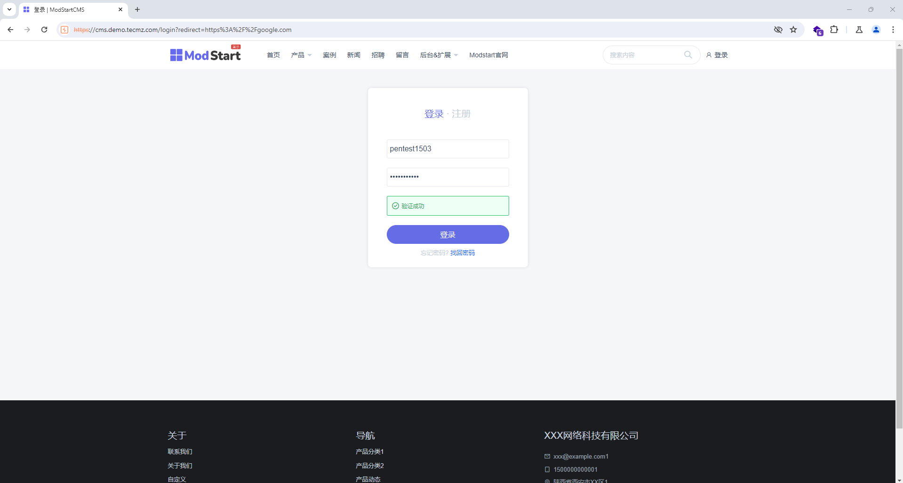
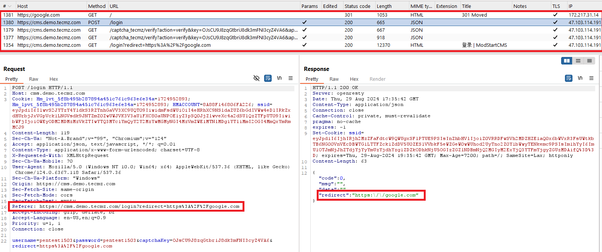

## In ModStartCMS v8.8.0, I found OpenRedirect Vulnerability in param "redirect" of user login feature  

ModStart CMS v8.8.0: https://github.com/modstart/ModStartCMS 
## Reproduce bug: 
Step 1: Access to https://cms.demo.tecmz.com/login?redirect=https%3A%2F%2Fgoogle.com and log in to an account.  

 Step 2: Website redirect to https://google.com  

I hope you know the impact of open redirect and more info refer 
https://cwe.mitre.org/data/definitions/601.html
